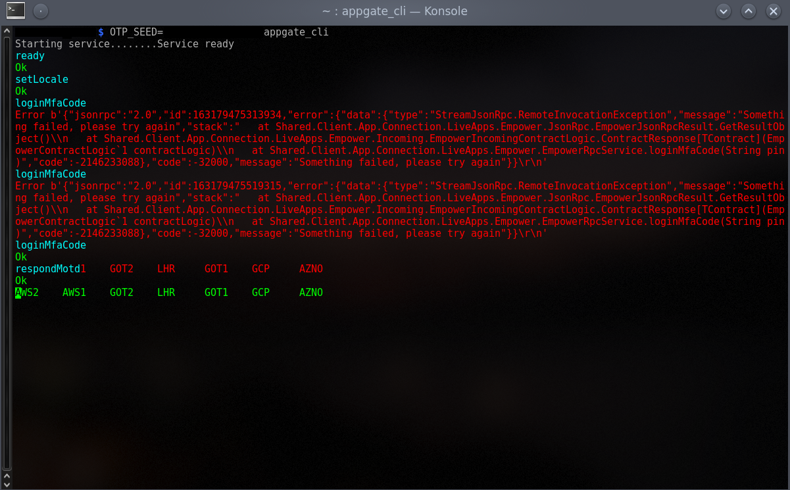

Appgate CLI
===========

Motivation
----------

Way easier to use than the normal GUI.

* No need to click anything once it's set up.
* No OTP (one time password) harassment

Usage
-----

*NOTE* This might vary depending on your administrator. So this is how I do it.

* Run the normal appgate within firejail, configure the profile, login.
* Go to settings and select autologin.
* Close the normal appgate
* Run `OTP_SEED=XXXXXX appgate_cli`
